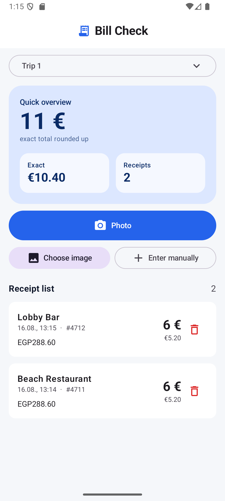

# Bill Check

Bill Check ist eine schlanke native Android-App, mit der Hotelbelege im Urlaub
erfasst und später mit Zwischen- oder Endrechnungen abgeglichen werden können.

Der Fokus liegt auf einem schnellen Ablauf: Beleg fotografieren, erkannte
Daten prüfen und bestätigen. Ohne Internet bleiben manuelle Erfassung,
gespeicherte Belege und Übersichten vollständig nutzbar.



## Geplanter Funktionsumfang

- mehrere frei sortierbare Reisen
- Belegfotos aus Kamera oder Galerie
- manuelle Eingabe und Cloud-KI-Erkennung
- centgenaue Umrechnung plus prominent aufgerundete Euroübersicht
- frei konfigurierbares Trinkgeld und Wechselkurse pro Beleg
- Zwischen- und Endabrechnungen mit automatischer sowie manueller Zuordnung
- PDF-/CSV-Berichte und vollständige `.billcheck`-Sicherungen
- Homescreen-Widget und integrierte GitHub-Updateverwaltung
- Deutsch und Englisch, heller und dunkler Modus

## Technischer Stand

- Kotlin / Jetpack Compose / Material 3
- Android 16 (API 36)
- Room-Datenbank
- App-ID `de.shakie.billcheck`

Das erste lauffähige Fundament umfasst Reiseanlage, lokale Speicherung,
manuelle Belegerfassung, Löschen von Belegen und die festgelegte
Rundungslogik. Kamera, KI-Erkennung und Rechnungsabgleich folgen iterativ.

## Build

```powershell
.\gradlew.bat assembleDebug --console=plain
```

Die öffentliche Projektdokumentation beginnt unter [`docs/README.md`](docs/README.md).
Reale Testbelege sind aus Datenschutzgründen nicht Bestandteil dieses
Repositories.

## Historischer Prototyp

`bill_check_v7.html` ist der ursprüngliche Offline-Webprototyp. Er dient nur
als fachliche Referenz und wird nicht in die Android-App eingebettet.

## Lizenz

Eine Open-Source-Lizenz wird vor dem ersten öffentlichen Release bewusst
festgelegt. Bis dahin gelten die gesetzlichen Urheberrechte.
